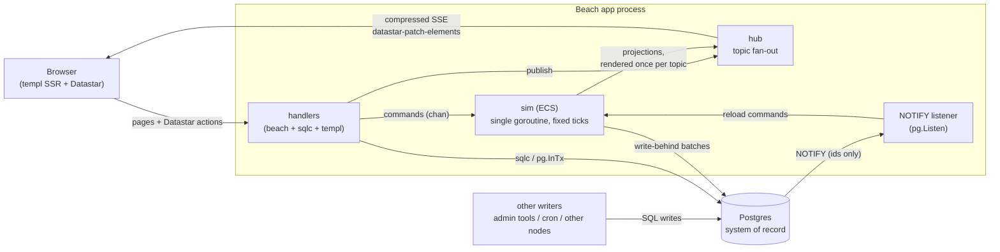
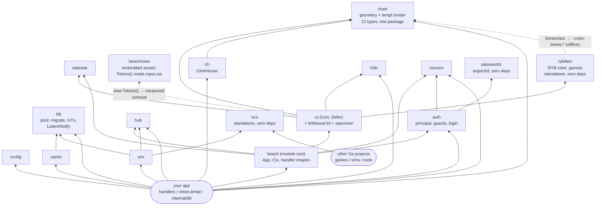

# Beach — documentation index

A reusable, hypermedia-first, SSR web framework for Go, with a custom entity
component system for realtime app state.
Stack: net/http · templ · Datastar (free core) · Tailwind v4 + rybitten · pgx · sqlc · goose · Postgres
LISTEN/NOTIFY · SSE · custom `ecs` engine. The module root is the framework's
front door: `import beach "github.com/ThirdCoastInteractive/Beach"`.

29 packages; `make build/vet/test` green. The root `beach` package, the
`driftwood` kit, `sim`, `chart`, `rybitten`, `apigen`, the scaffold/lint tooling,
and all four example apps compile, test, and serve — each mounting `ui/specimen`
at `/specimen`. The RFC and architecture docs are the design of record.

## The realtime spine

How a beach app hangs together — handlers, the sim, the hub, and Postgres:

## Package dependencies

Arrows point at what a package imports. The boot spine stands alone; `ecs` imports
nothing and is importable by anything, Beach or not; the root `beach` package is
what an app touches first:

(The dotted edge is not a Go import: `rybitten.SeriesVars` generates the
`--color-series-*` CSS variables in `input.css` that `chart` consumes at runtime;
the solid `ui --> rybitten` edge is the specimen's gamut preview — see
[19 — rybitten](architecture/19-rybitten.md).)

## RFC — the why and the what

| Doc                                      | Covers                                                       |
| ---------------------------------------- | ------------------------------------------------------------ |
| [1 — Charter](rfc/01-charter.md)         | Problem, goal, non-goals, philosophy                         |
| [2 — Scope](rfc/02-scope.md)             | Every package and its responsibility; the framework laws     |
| [3 — The ECS pitch](rfc/03-ecs.md)       | Why a custom engine, the design pillars, the hybrid boundary |
| [5 — WebSockets](rfc/05-websockets.md)   | `App.Socket`: the non-hypermedia channel, coalescing, relay  |
| [6 — Accessibility](rfc/06-accessibility.md) | WCAG 2.1 AA as a law: the audit, the palette move, names as translations, the live region, pausing a stream, the keyboard layer for charts, enforcement, and the known exceptions |

## Architecture — the how

| Doc                                                     | Covers                                                                                   |
| ------------------------------------------------------- | ---------------------------------------------------------------------------------------- |
| [1 — Layout](architecture/01-layout.md)                 | Stack contract, module layout per go.dev/doc/modules/layout                              |
| [2 — Boot spine](architecture/02-boot-spine.md)         | `config`, `pg` (pool, advisory-lock migrate, InTx, Listen/Notify)                        |
| [3 — HTTP layer](architecture/03-http.md)               | Root `beach` package: App builder, handler shapes (incl. `Socket`), guards, SSE gzip     |
| [4 — Hub](architecture/04-hub.md)                       | Topic fan-out, render-once-per-topic, tickers                                            |
| [5 — Cache, session, i18n](architecture/05-services.md) | Snapshot/keyed caches, NOTIFY invalidation, Postgres sessions, i18n                      |
| [6 — UI toolkit](architecture/06-ui.md)                 | Views as templ, the driftwood kit, tokens, no pop-in, no blocking, the 14KB rule, deferred sections, accessible by construction |
| [7 — ECS engine](architecture/07-ecs.md)                | The custom standalone engine: schema, Store, change ticks                                |
| [8 — Sim](architecture/08-sim.md)                       | The boundary, tick loop, projections, persistence lanes                                  |
| [9 — Lifecycles](architecture/09-lifecycles.md)         | Page / action / stream / external write, end to end                                      |
| [10 — Tooling & testing](architecture/10-tooling.md)    | `beach new` / `beach ecs gen` / `beach i18n` / `beach-vet`, test doctrine                |
| [12 — Auth](architecture/12-auth.md)                    | argon2id passwords, login flow, principal/RBAC, guards                                   |
| [13 — API codegen](architecture/13-apigen.md)           | `beach-apigen`: six SQL annotations → routes, handlers, NOTIFY (hypermedia-only)         |
| [14 — Analytics](architecture/14-analytics.md)          | `chart` (one package: geometry + templ render, 22 types, fragments, the client interaction layer) + `ch` (ClickHouse client, batcher, migrations, query→chart adapters) |
| [15 — Example apps](architecture/15-examples.md)        | boardwalk (sim + live bar race), driftbottle (hub), pantry (apigen+analytics), booking-manager (mailer+sms, Postgres-only) |
| [16 — Component catalog](architecture/16-components.md) | The concrete driftwood component inventory, and the `ui/specimen` page every example mounts |
| [19 — rybitten](architecture/19-rybitten.md)            | RYB color model port, 36 gamut presets, `SeriesVars` → the `--color-series-*` tokens, the specimen gamut preview |
| [20 — sync boundary](architecture/20-sync.md)          | Why no sync engine; the sync unit is HTML, not data; read-path liveness via the hub; the topic-scope rule; the offline exit condition |

## Reading paths

- **Auditing the ECS?** RFC 3 → Architecture 7 → 8 → 9.
- **Auditing the frontend story?** Architecture 3 → 6 → 16 → 9.
- **Auditing accessibility?** RFC 6 → Architecture 6 (the law) → 16 (the per-component contract) → 10 (what `beach-vet` checks).
- **Auditing auth & codegen?** Architecture 12 → 13 → 10.
- **Changing the color palette?** Architecture 19 → 14 (chart theming) → 6 (UI tokens).
- **Auditing the sync/realtime story?** Architecture 4 (hub) → 8 (sim) → 20 (the sync boundary).
