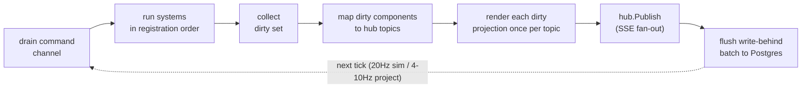

# Architecture 8 — `sim`: the tick-loop integration over `ecs`

[← docs index](../README.md) · prev: [ECS engine](07-ecs.md) · next: [Lifecycles](09-lifecycles.md)

`sim` runs a simulation: it owns an `ecs.Store`, drives the fixed tick loop, accepts
commands from handlers, and projects state changes onto hub topics. It's the only
bridge between `ecs` and the web packages.

## The boundary

Read this before adding a component.

The sim hosts the **live slice**: currently-connected users, the active show, and
their hot components — anything mutated every tick or every few seconds and read by
fan-out rendering (presence, XP accrual, buffs, cooldowns, drop timers, equipped
items, live show state). Entities load on connect/show-start and evict on
disconnect/show-end.

The sim never hosts: auth, sessions, account CRUD, payments, trade settlement,
calendars, or anything whose primary access pattern is an ad-hoc relational query.
Postgres's ACID and SQL are the feature there — the database already is an ECS for
cold data. **Money, items, and trades commit to Postgres in a synchronous transaction
first; the sim reflects the committed result.** XP, presence, and ephemera flow the
other way: sim first, write-behind to Postgres.

## Single-writer loop

```go
s := sim.New(sim.Config{TickRate: 20, ProjectRate: 8})
s.AddSystems(xp.System{}, presence.System{}, drops.System{})  // fixed order
go s.Run(ctx)

// Handlers never touch the store directly:
s.Send(cmd.AwardXP{User: uid, Amount: 50})                     // fire-and-forget
reply, err := sim.Ask[cmd.CraftResult](ctx, s, cmd.Craft{...}) // request/reply
```

One goroutine owns the store. Commands arrive on a channel and are drained at the top
of each tick; systems run in registration order; no locks anywhere. Determinism makes
tests trivial: construct sim, send commands, tick N times, assert.

Tick pipeline:



Sim rate and projection fan-out rate are decoupled (20Hz sim / 4–10Hz projection is
plenty for a website — the Unity Netcode snapshot-rate pattern).

## Off-loop reads: `Snapshot`

Projections push *changes* to subscribers, but a handler serving a page-nav or
opening an SSE stream needs the *current whole board* to catch up — and the store
belongs to the loop. The old answer was a per-nav `Ask` round-trip for every read;
the first-class one is `Sim.Snapshot`:

```go
v, err := s.Snapshot(ctx)              // one capture on the loop
if err != nil { return err }
for e, t := range ecs.ViewQuery[comp.Tile](v) {
    catchUpRender(e, t)                // read freely off-loop
}
```

`Snapshot` runs `ecs.Store.View()` inside a command on the loop goroutine (via the
same `AskFunc` machinery as `Ask`), so the copy is taken under exclusive store access
and is consistent as of that tick. The returned `*ecs.View` shares no memory with the
store, so the handler reads it (with [`ecs.ViewQuery` / `ViewGet` / `ViewChanged` /
`ViewHas`](07-ecs.md#off-loop-reads-view)) on its own goroutine while the loop keeps
ticking — no locks, no further round-trips. It blocks until the loop processes the
capture (returning `ctx.Err()` if `ctx` is cancelled first), so call it only once
`Run` owns the loop; before `Run`, copy `s.Store().View()` on the constructing
goroutine instead. One capture replaces the per-read `Ask` chatter the catch-up path
used to need.

## Projections: change detection → patches

A **projection** maps a component change onto a hub topic and a templ view — the
event-sourcing word for exactly this job: deriving a read view from state changes.

Change detection is [native to `ecs`](07-ecs.md#the-portable-core-model): mutation
through the generated accessors stamps the component column with the current tick,
and the sim collects each tick's dirty set with `ecs.Changed[T]` queries — no
observers, no manual dirty flags. The app registers projections:

```go
sim.Project(s, sim.Projection[comp.XP]{
    Topic:  func(e ecs.Entity, xp comp.XP) string { return "user:" + owner(e) },
    Target: "xp-bar",                     // same Target semantics as beach.View
    View:   func(e ecs.Entity, xp comp.XP) templ.Component { return ui.XPBar(xp) },
})
```

After each projection tick, every dirty (entity, component) renders its view once
and publishes the patch to its topic; the hub writes it to every subscribed SSE
connection as a `datastar-patch-elements` event. "Only send what changed to who can
see it" is interest management, and it falls out of the dirty set — nothing diffs the
DOM, nothing polls.

### Whole-surface projections: `ProjectAny`

`Projection[T]` keys on one named component. But a surface often derives from several
components, and "re-render the surface when *any* of them changed" used to mean a
workaround: every mutating command had to also `touch` a singleton trigger component
(boardwalk's `touchBoard`) just to flag the shared board dirty — implicit coupling
that every new command had to remember. `ProjectAny` makes the trigger set explicit:

```go
sim.ProjectAny(s, sim.AnyProjection{
    Topic: func(e ecs.Entity) string { return "board" },        // one shared surface
    View:  func(e ecs.Entity) []byte { return renderBoard() },  // reads its own state
},
    sim.MemberOf[comp.Tile](),
    sim.MemberOf[comp.Piece](),
    sim.MemberOf[comp.Score](),
)
```

It fires when any listed `MemberOf[T]` member's column was stamped since the last
pass. Unlike `Projection[T]`, the callbacks get only the changed entity, not a
component value — a whole-surface render reads the state it needs itself (typically
through an [`ecs.View`](07-ecs.md#off-loop-reads-view) or a closure over the store on
the loop). Each pass unions the dirty entities across every member (deduped, so an
entity that changed in two member columns counts once), maps them to topics, and
renders **each distinct topic exactly once** — a shared surface fed by many changed
members emits a single frame, not one per entity. When several entities map to the
same topic, the first encountered represents it.

`ProjectAny` composes with `Project`: both feed the same per-topic dedupe map each
pass (later registration wins a contested topic). It must be given at least one member
— a projection that can never fire is a bug, and it panics. Listing the components a
surface derives from retires the manual-touch pattern: there is no trigger component
to keep in sync, so no command can forget it.

## Persistence

Three lanes, chosen per component:

| Lane           | For                                    | Mechanism                                                                                                                                                 |
| -------------- | -------------------------------------- | --------------------------------------------------------------------------------------------------------------------------------------------------------- |
| Synchronous tx | money, items, trades, anything audited | handler does `pg.InTx` first, then `s.Send(ApplyCommitted{...})`                                                                                          |
| Write-behind   | XP, presence, stats                    | dirty components batched and upserted to component-mirror tables each flush tick (sqlc queries, mechanical mapping: component = table keyed by entity id) |
| Snapshot       | pure ephemera (cooldowns, buffs)       | versioned CBOR `ecs` snapshot on shutdown / interval; restore is best-effort                                                                              |

Component-mirror tables keep the data legible to plain SQL, admin tooling, and
analytics — no opaque store blob as system of record. The token ledger is an
append-only journal table regardless of lane.

`cmd/examples/boardwalk` is the runnable example of the **snapshot lane**: a ticker
periodically `Ask`s the loop for `ecs.Store.Save()` (versioned CBOR) and upserts
the blob into a single-row Postgres table; on boot it loads the row, `ecs.Load`s
it, and hands the store to `sim.New` via `sim.Config.Store` so a restart resumes
the game. It is deliberately snapshot-only — the demo shows the lane, not a
component-mirror system of record.

## Other writers

Admin tools, cron, and other processes mutate Postgres directly. Triggers NOTIFY with
ids; a `pg.Listen` listener in the app turns those into sim commands
(`s.Send(cmd.ReloadEntity{Table: "items", ID: id})`). That's the whole multi-writer
story in v1 — and the seam (`pg.Listen` → commands, `hub` → fan-out) is exactly where
NATS would replace Postgres NOTIFY if the app ever spans nodes.
