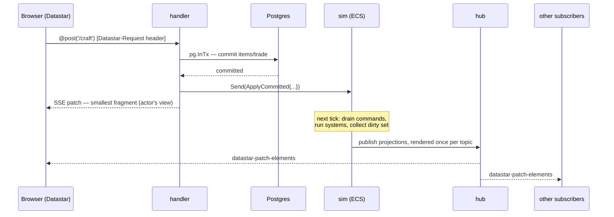

# Architecture 9 — Lifecycles, end to end

[← docs index](../README.md) · prev: [Sim](08-sim.md) · next: [Tooling & testing](10-tooling.md)

**Page request:** route → guards (session, role) → `PageFunc` →
`db.New(pool)` → sqlc → `View.Page` (a templ component) rendered — final state,
no pop-in → browser. A Datastar refresh of the same URL takes the same path but the framework
patches `View.Fragment` into `View.Target` instead.

**Datastar action:** `@post('/thing')` → guards → `ActionFunc` (framework already
verified `Datastar-Request` + CSRF) → `beach.Bind` → mutation via `c.InTx` and/or
`s.Send` → returned `Patches` written over SSE — smallest fragment, actor's view →
(sim/hub later pushes the same change to everyone else subscribed).

**SSE stream:** `@get('/stream')` on load → guards → `StreamFunc` returns a `Sub`
(topics + catch-up) → framework runs the loop: `?since=` catch-up render, subscribe,
block on the topic channels, write patches until disconnect → device/session row
closed, a 30-second reaper sweeps stale rows.

**Deferred section:** below-the-fold `ui.Defer` placeholder (exact reserved
dimensions, shipped in the ≤14KB first response) → `@get` on viewport intersection →
same `PageFunc`, fragment branch → patch fills the reserved space — no layout shift.

**External write:** admin app commits → trigger NOTIFYs id → listener re-queries →
sim command or direct hub publish → projections patch on every subscribed client.
